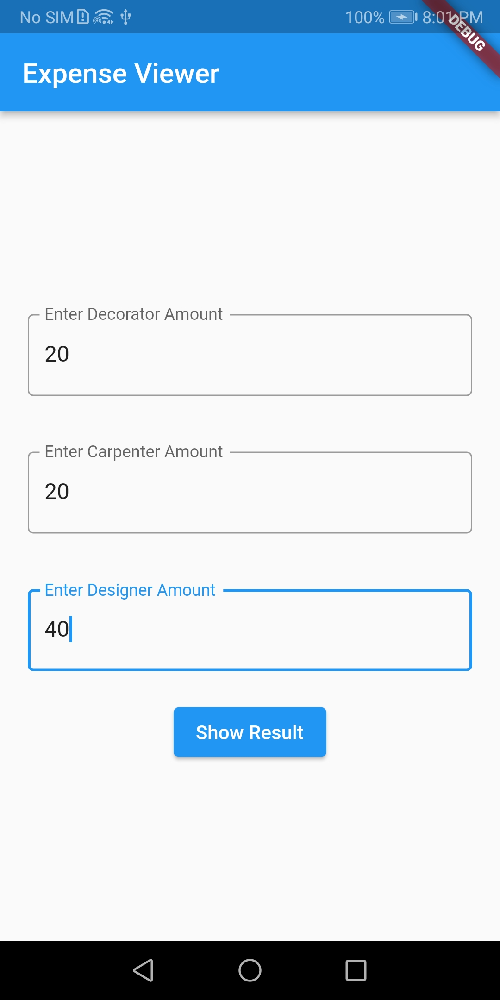
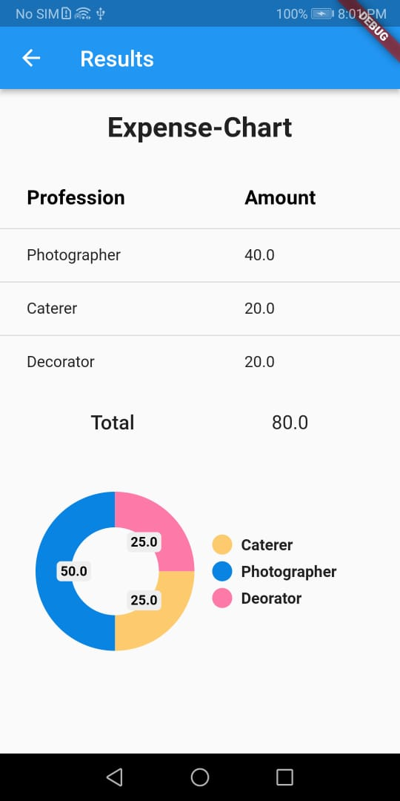
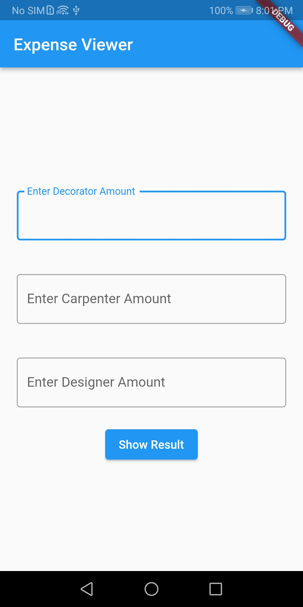

# task

A new Flutter project.
The basic home page contains the three text fields and the submit button onpressed it will navigate to the the result page where data is shown in the tabular form and and it is displayed in the for of pie chart by using import cupertino_icons: ^1.0.2 ,version pie_chart: ^5.1.0. the 
chart type used is ring.

